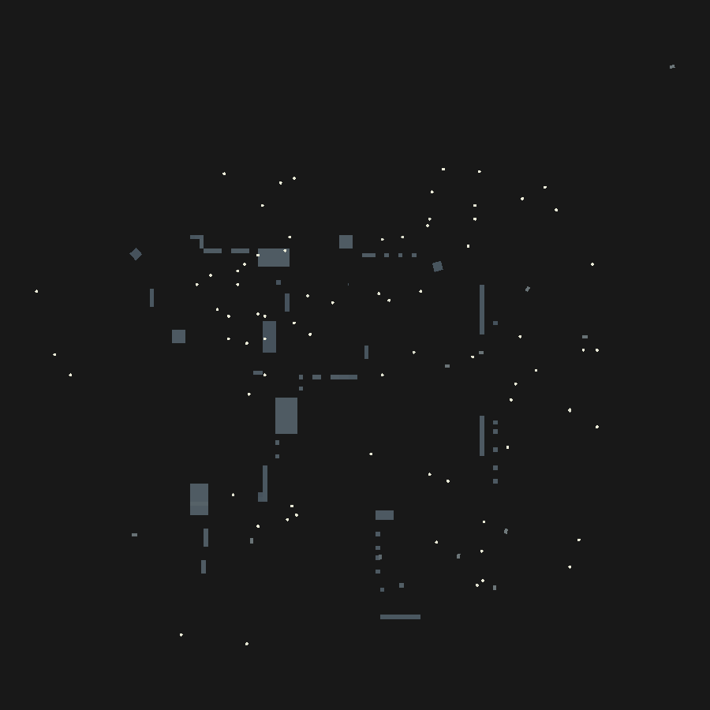
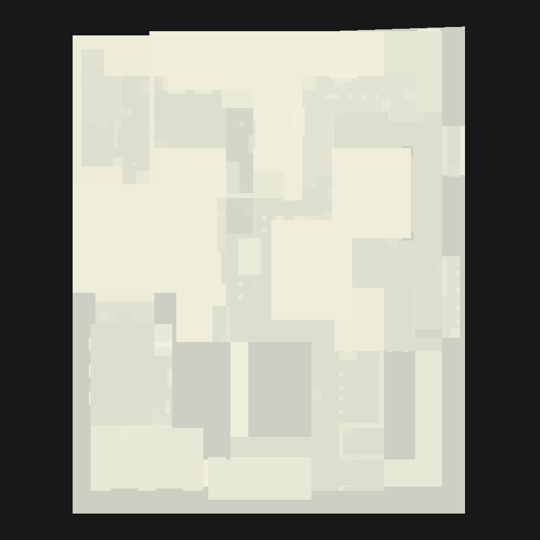

# Static batching repair — Block Strike 4.1.0

Status: **done for all 59 exported scenes**, verified offline against the
original combined meshes. Opening a map in Unity is still the final check.

## The bug ("flying barrels" on Bust)

The APK ships *built* scenes, so Unity 4.7.2f1 had already merged every static
renderer of a map into one `Combined Mesh (root: scene)` asset per scene. The
export reproduces that layout verbatim:

* the batched `MeshFilter`s all point at the same combined mesh
  (`Bust`: 120 of 256 renderers → `Assets/Mesh/Combined Mesh (root_ scene)_22.asset`);
* the combined mesh vertices are stored in **static-batch-root space**, which for
  this export is world space (`m_StaticBatchRoot: {fileID: 0}` on every batched
  renderer);
* each renderer picked its own geometry through the Unity 4 field
  `m_SubsetIndices` — little-endian `uint32` submesh indices, e.g.
  `m_SubsetIndices: 2c000000` = submesh 44.

Unity 5 replaced `m_SubsetIndices` with `m_StaticBatchInfo`, so a modern editor
ignores the field completely. Every batched renderer then falls back to
"submesh *i* for material *i*", i.e. submesh 0 of the combined mesh, and draws it
*again* through its own transform (the vertices were already in world space).

On `Bust` submesh 0 happens to be a barrel. Result: the walls, floors and crates
of the map are gone and ~120 copies of one barrel hover around the level — the
screenshot that started this work.

Evidence (all read from the export, nothing assumed):

| Check | Value |
| --- | --- |
| `Bust` renderers / batched | 256 / 120 |
| Combined mesh | `Combined Mesh (root: scene)`, 175 submeshes, 6232 vertices, stride 40, channels `pos f32x3, nrm f16x4, color unorm8, uv0 f16x2, uv1 f16x2, tan f16x4` |
| Submesh 1 AABB centre | `(12.4999, 65.55, 10.0)` = world position of the `Barrel` whose renderer holds `m_SubsetIndices: 01000000` |
| Index buffer | 16-bit, indices are absolute (include `firstVertex`) |

## The repair

`tools/debatch_static_meshes.py` turns each batched renderer back into a normal
standalone mesh:

1. read the submeshes listed in `m_SubsetIndices`, in material order;
2. copy their vertex ranges out of the combined vertex buffer;
3. move the vertices from batch-root space into the renderer's own local space
   (`inverse(worldMatrix) · v`), rotating normals/tangents when the renderer has
   rotation or scale (byte-identical copy when it does not, which is the common
   case in these maps);
4. rebase the 16-bit indices and recompute submesh/mesh AABBs;
5. write `client/Assets/Mesh/Debatched/<Map>/<GameObject>_<fileID>.asset` plus a
   `.meta` with a deterministic GUID (MD5 of scene path + renderer fileID, so
   re-running the tool never churns GUIDs);
6. patch the scene *minimally*: `m_Mesh` of the MeshFilter, `m_Mesh` of a
   MeshCollider on the same GameObject when it used the combined mesh (none in
   4.1.0 — collision geometry was never batched), and `m_SubsetIndices` rewritten
   as a plain `0..n-1` sequence.

Transforms, colliders, components, lightmap indices, `m_LightmapTilingOffset`,
materials and script references are **not** touched, so nothing that depends on
object positions or GUID/fileID links changes. The original combined meshes stay
in the project as ground-truth evidence for the verifier.

## Results

```
59 scenes, 4305 batched renderers, 4305 repaired, 4305 new mesh assets,
0 warnings, 0 renderers left on a combined mesh
```

Per-scene numbers: [`static-batching-report.json`](static-batching-report.json).
Per-map manifests (renderer → submeshes → new asset): `tools/static-batch-manifests/`.

Top-down preview of `Bust`, rendered from the scene data without Unity
(`tools/preview_scene_topdown.py`), emulating what the editor actually draws:

| before (submesh 0 everywhere) | after |
| --- | --- |
|  |  |

## Verification

`tools/verify_static_batching.py` re-derives the world geometry and compares it
to the APK export:

* every scene scanned for renderers still pointing at a combined mesh → **0**;
* every `m_Mesh` reference in every scene resolves to an existing asset
  (Unity built-in GUIDs excluded);
* for each of the 4305 manifest entries the de-batched mesh is pushed back
  through the renderer's world matrix and compared **vertex by vertex and
  triangle by triangle** with the original submeshes;
* asset `.meta` GUIDs match the GUIDs the scenes reference.

```
$ python3 tools/verify_static_batching.py
scenes scanned: 59 | renderers verified against the combined meshes: 4305 |
still batched: 0 | max world drift: 0.000015
OK
```

Max drift 1.5e-5 units is float32 round-off from the inverse-transform, far below
anything visible or collidable.

## Re-running / rollback

```bash
python3 tools/debatch_static_meshes.py --list
python3 tools/debatch_static_meshes.py --scene Bust --dry-run
python3 tools/debatch_static_meshes.py --all --report docs/static-batching-report.json
python3 tools/verify_static_batching.py
python3 tools/preview_scene_topdown.py --scene Bust --out /tmp/bust.png
```

The tool is idempotent: a repaired scene reports `batched=0` and is left alone.
Rollback is a `git checkout` of `client/Assets/Levels` plus deleting
`client/Assets/Mesh/Debatched/`; the ground-truth combined meshes are untouched.

## Known limits / TODO

* `TODO: unverified` — the maps have not yet been opened one by one in Unity
  2021.3.45f2 after this change; only `Bust` was reported broken and the repair
  is verified offline for all scenes.
* Occlusion culling data (`SceneSettings.m_PVSData`, `OcclusionArea`) still refers
  to the old batched objects; Unity reports "Occlusion culling data is out of
  date" and it must be rebaked (or dropped) separately.
* Lightmaps are unchanged: `uv1` comes straight from the combined mesh and the
  renderer keeps its original `m_LightmapIndex`/`m_LightmapTilingOffset`.
* Only the verified Unity 4 layout is handled: single-stream, uncompressed
  interleaved vertex data, 16-bit indices, triangle topology. Anything else
  raises `UnsupportedLayout` instead of guessing (none occurred in 4.1.0).
* Prop meshes stored with `m_MeshCompression != 0` (e.g. `RedBlock_0.asset`) are
  not read by these tools; they are not batched geometry, so they are skipped.
